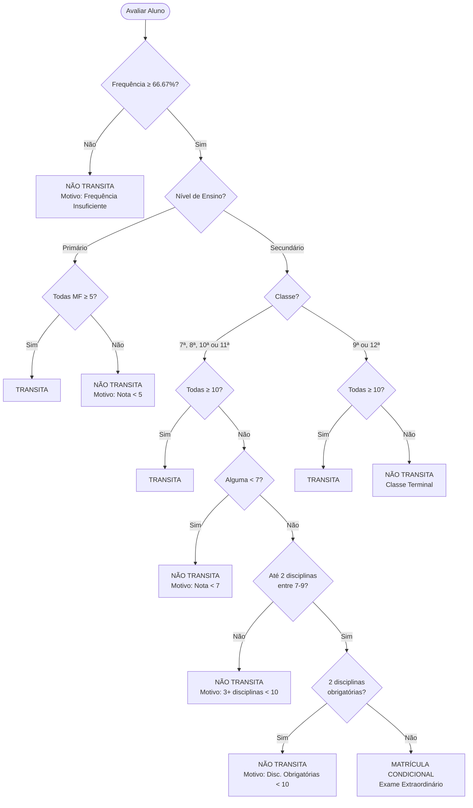

# Regras de Avaliação do Sistema de Ensino Geral em Angola

> [!IMPORTANT]
> Este documento define as **regras oficiais permanentes** para determinação de Transição/Retenção no Sistema de Avaliação Escolar em Angola. Todas as funcionalidades do sistema devem obedecer rigorosamente a estas normas.

---

## 1. REGRA GERAL

A decisão de **Transita** ou **Não Transita** deve obedecer obrigatoriamente às normas oficiais do Sistema de Ensino em Angola, com **validação automática no frontend e no backend**.

### 1.1 Princípios Fundamentais

- **Arredondamento**: As classificações finais ou "MF" (Média Final) devem ser arredondadas à unidade mais próxima **antes** da decisão de transição
- **Frequência Mínima**: Considera-se frequência insuficiente quando a frequência anual for inferior a **66,67%**
- **Frequência Insuficiente**: Implica automaticamente **Não Transita**, independentemente das notas
- **Documentação Obrigatória**: Sempre que o aluno **Não Transita**, o sistema deve exigir:
  - Motivo de retenção
  - Observação explicativa padronizada

---

## 2. ENSINO PRIMÁRIO (1.ª a 6.ª Classe)

### 2.1 Critérios de Transição

O aluno **TRANSITA** quando:
- Classificação final (MF) ≥ **5 valores** em **TODAS** as disciplinas
- Frequência anual ≥ **66,67%**

### 2.2 Critérios de Retenção

O aluno **NÃO TRANSITA** quando:
- Pelo menos **uma disciplina** com nota < **5 valores**
- OU frequência anual < **66,67%**

### 2.3 Classe Terminal (6.ª Classe)

- É classe de **Exame Nacional**
- O sistema deve registar o **tipo de exame**
- Aplicam-se as **mesmas regras de aprovação** (MF ≥ 5 em todas as disciplinas)

### 2.4 Campos de Exportação

Devem ser exibidos e exportados:
- Estado: **Transita** / **Não Transita**
- Observação correspondente à transição ou retenção
- Frequência anual (%)
- Tipo de exame (se aplicável)

---

## 3. ENSINO SECUNDÁRIO – I CICLO (7.ª, 8.ª e 9.ª Classes)

### 3.1 Critérios de Transição Plena

O aluno **TRANSITA** quando:
- Classificação final ≥ **10 valores** em **TODAS** as disciplinas
- Frequência anual ≥ **66,67%**

### 3.2 Transição Condicional (7.ª e 8.ª Classes)

Nas **7.ª e 8.ª classes**, é permitida a transição com:
- Até **duas disciplinas** com nota entre **7 e 9 valores**
- **EXCETO** se forem simultaneamente **Língua Portuguesa** e **Matemática**

**Consequências:**
- Aluno fica em **matrícula condicional**
- Deve ser registado **Exame Extraordinário** conforme calendário oficial
- A conclusão definitiva do ano permanece **bloqueada** até ao resultado final

### 3.3 Critérios de Retenção

O aluno **NÃO TRANSITA** quando:
- Três ou mais disciplinas com nota < 10 valores
- OU duas disciplinas com nota < 10, sendo simultaneamente Língua Portuguesa e Matemática
- OU qualquer disciplina com nota < 7 valores
- OU frequência anual < 66,67%

### 3.4 9.ª Classe

- Aplicam-se os critérios de transição plena (≥ 10 em todas)
- **Não é permitida** matrícula condicional
- É classe terminal do I Ciclo

---

## 4. ENSINO SECUNDÁRIO – II CICLO (10.ª, 11.ª e 12.ª Classes)

### 4.1 Critérios de Transição Plena

O aluno **TRANSITA** quando:
- Classificação final ≥ **10 valores** em **TODAS** as disciplinas
- Frequência anual ≥ **66,67%**

### 4.2 Transição Condicional (10.ª e 11.ª Classes)

Nas **10.ª e 11.ª classes**, é permitida a transição com:
- Até **duas disciplinas** com nota entre **7 e 9 valores**
- **EXCETO** se forem simultaneamente **disciplinas obrigatórias do curso**

**Disciplinas Obrigatórias por Curso (configuráveis pelo administrador):**
- Por defeito: **Língua Portuguesa** e **Matemática**
- Podem ser configuradas disciplinas específicas por curso (ex: Física e Química para Ciências)

**Consequências:**
- Aluno fica em **matrícula condicional**
- Deve ser registado **Exame Extraordinário** conforme calendário oficial
- A conclusão definitiva do ano permanece **bloqueada** até ao resultado final

### 4.3 Critérios de Retenção

O aluno **NÃO TRANSITA** quando:
- Três ou mais disciplinas com nota < 10 valores
- OU duas disciplinas com nota < 10, sendo simultaneamente disciplinas obrigatórias do curso
- OU qualquer disciplina com nota < 7 valores
- OU frequência anual < 66,67%

### 4.4 12.ª Classe (Terminal)

- Aplicam-se os critérios de transição plena (≥ 10 em todas)
- **Não é permitida** matrícula condicional
- É classe terminal do II Ciclo e de **Exame Nacional**
- O resultado do exame integra a avaliação final

---

## 5. REGRAS DE EXAMES

### 5.1 Tipos de Prova

O sistema deve registar o tipo de prova:
- **Exame Nacional**: Classes terminais (6.ª, 9.ª, 12.ª)
- **Exame Extraordinário**: Alunos em matrícula condicional (7.ª, 8.ª, 10.ª e 11.ª)
- **Recurso**: Conforme calendário oficial

### 5.2 Integração do Resultado

- O resultado do exame **integra a avaliação final**
- Influencia **directamente** o estado Transita ou Não Transita
- Deve ser aplicado o arredondamento à unidade mais próxima

### 5.3 Matrícula Condicional

Sempre que o aluno estiver em **matrícula condicional**:
- A conclusão definitiva do ano deve permanecer **bloqueada**
- Até ao resultado final do Exame Extraordinário
- O sistema deve exibir claramente o estado "Aguardando Exame Extraordinário"

---

## 6. EXPORTAÇÃO E RELATÓRIOS

### 6.1 Campos Obrigatórios

Todos os relatórios e ficheiros exportados devem incluir **claramente**:

| Campo | Descrição |
|-------|-----------|
| **Estado** | Transita / Não Transita / Matrícula Condicional |
| **Observações** | Texto padronizado conforme situação |
| **Motivo de Retenção** | Obrigatório quando Não Transita |
| **Frequência (%)** | Percentual de frequência anual |
| **Tipo de Exame** | Nacional / Extraordinário / Recurso (se aplicável) |
| **Arredondamento Aplicado** | Indicar quando influenciou a decisão final |

### 6.2 Documentos Afectados

- **Pauta Geral**
- **Termos de Frequência**
- **Ficha de Alunos**
- **Relatórios Estatísticos**
- **Exportações CSV/Excel/PDF**

---

## 7. OBSERVAÇÕES PADRONIZADAS

### 7.1 Transição Plena

```
"Transitou por ter obtido classificação igual ou superior a [LIMIAR] valores em todas as disciplinas e frequência de [X]%."
```

### 7.2 Transição Condicional

```
"Transitou condicionalmente com [N] disciplina(s) entre 7 e 9 valores: [DISCIPLINAS]. Deve realizar Exame Extraordinário conforme calendário oficial."
```

### 7.3 Retenção por Nota

```
"Não transitou por ter obtido classificação inferior a [LIMIAR] valores em [N] disciplina(s): [DISCIPLINAS]."
```

### 7.4 Retenção por Frequência

```
"Não transitou por frequência insuficiente ([X]%, inferior ao mínimo de 66,67%)."
```

### 7.5 Retenção por Língua Portuguesa e Matemática

```
"Não transitou por ter obtido classificação inferior a 10 valores simultaneamente em Língua Portuguesa e Matemática."
```

---

## 8. VALIDAÇÃO NO SISTEMA

### 8.1 Frontend

- Validação em tempo real ao inserir notas
- Cálculo automático de MF com arredondamento
- Alerta visual quando aluno não atinge critérios de transição
- Bloqueio de submissão quando faltam campos obrigatórios

### 8.2 Backend

- Validação obrigatória antes de gravar na base de dados
- Recálculo de MF e estado de transição
- Verificação de frequência mínima
- Aplicação de regras específicas por nível de ensino
- Registo de auditoria de todas as decisões

### 8.3 Base de Dados

- Campos calculados para MF arredondada
- Campo de estado: `transita` (boolean ou enum)
- Campo de observação padronizada
- Campo de motivo de retenção
- Campo de tipo de exame
- Triggers para garantir consistência

---

## 9. FLUXOGRAMA DE DECISÃO



---

## 10. CASOS ESPECIAIS

### 10.1 Aluno Transferido

- Aplicar regras da classe de destino
- Considerar frequência acumulada
- Validar equivalência de disciplinas

### 10.2 Aluno com Necessidades Educativas Especiais

- Aplicar adaptações curriculares aprovadas
- Manter registo de despacho oficial
- Documentar critérios específicos aplicados

### 10.3 Aluno Repetente

- Aplicar as mesmas regras
- Registar histórico de retenções anteriores
- Alertar quando ultrapassar limite de retenções por classe

---

## 11. IMPLEMENTAÇÃO TÉCNICA

### 11.1 Estrutura de Dados Sugerida

```typescript
interface AvaliacaoAluno {
  alunoId: string;
  classeId: string;
  anoLectivo: string;
  disciplinas: DisciplinaAvaliacao[];
  frequenciaAnual: number; // percentual
  mediaFinal: number; // arredondada
  transita: boolean;
  observacao: string;
  motivoRetencao?: string;
  tipoExame?: 'Nacional' | 'Extraordinário' | 'Recurso';
  matriculaCondicional: boolean;
}

interface DisciplinaAvaliacao {
  disciplinaId: string;
  nomeDisciplina: string;
  notaFinal: number; // arredondada
  aprovado: boolean;
}
```

### 11.2 Função de Validação (Pseudocódigo)

```typescript
function determinarTransicao(avaliacao: AvaliacaoAluno): ResultadoTransicao {
  // 1. Verificar frequência
  if (avaliacao.frequenciaAnual < 66.67) {
    return {
      transita: false,
      motivo: 'Frequência insuficiente',
      observacao: gerarObservacaoFrequencia(avaliacao.frequenciaAnual)
    };
  }
  
  // 2. Aplicar regras por nível
  const nivel = obterNivelEnsino(avaliacao.classeId);
  
  switch (nivel) {
    case 'PRIMARIO':
      return avaliarPrimario(avaliacao);
    case 'SECUNDARIO_I':
      return avaliarSecundarioI(avaliacao);
    case 'SECUNDARIO_II':
      return avaliarSecundarioII(avaliacao);
  }
}
```

---

## 12. PERSISTÊNCIA E MANUTENÇÃO

> [!CAUTION]
> Estas regras devem permanecer **activas para todas as funcionalidades actuais e futuras** do sistema de avaliação, sem necessidade de novas instruções.

### 12.1 Versionamento

- Manter histórico de alterações às regras
- Registar data e fonte oficial de cada actualização
- Aplicar novas regras apenas a partir do ano lectivo especificado

### 12.2 Auditoria

- Registar todas as decisões de transição/retenção
- Manter log de cálculos e arredondamentos
- Permitir rastreabilidade completa

### 12.3 Testes

- Criar casos de teste para cada cenário
- Validar automaticamente antes de cada release
- Testar edge cases (ex: nota 4.5, 9.5, etc.)

---

## 13. REFERÊNCIAS LEGAIS

- Decreto Presidencial sobre o Sistema de Educação e Ensino
- Despachos Ministeriais sobre Avaliação das Aprendizagens
- Editais de Exames Nacionais (actualizados anualmente)
- Regulamento Interno das Escolas

---

**Documento criado em**: 2025-12-15  
**Última actualização**: 2025-12-15  
**Versão**: 1.0  
**Responsável**: Sistema de Avaliação Escolar - Angola
