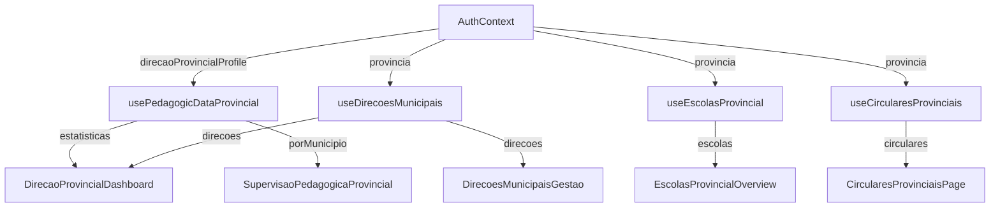

# Documentação Frontend - Perfil Direcção Provincial

## Visão Geral

O módulo de **Direção Provincial** do EduGest Angola permite a supervisão e gestão educacional a nível provincial. Este perfil tem autoridade sobre todas as Direções Municipais e escolas dentro da sua província.

---

## Hierarquia do Sistema

```
SUPERADMIN (Nacional)
    ↓
DIREÇÃO PROVINCIAL (Província) ← ESTE DOCUMENTO
    ↓
DIREÇÃO MUNICIPAL (Município)
    ↓
ESCOLA
    ↓
PROFESSOR → ALUNO → ENCARREGADO
```

---

## Estrutura do Módulo

```
src/modules/provincial_education/
├── api/
│   ├── circularesProvinciais.ts          # CRUD de circulares provinciais
│   ├── direcoesMunicipaisManagement.ts   # Gestão de direções municipais
│   ├── escolasProvincialQuery.ts         # Consulta de escolas (read-only)
│   ├── pedagogicSupervisionProvincial.ts # Supervisão pedagógica
│   └── relatoriosProvinciais.ts          # Relatórios consolidados
├── components/
│   ├── CircularesProvinciaisPage.tsx     # Página de circulares
│   ├── DirecaoProvincialDashboard.tsx    # Dashboard principal
│   ├── DirecoesMunicipaisGestao.tsx      # Gestão de direções
│   ├── EscolasProvincialOverview.tsx     # Overview de escolas
│   ├── RelatoriosProvinciaisPage.tsx     # Página de relatórios
│   ├── SupervisaoPedagogicaProvincial.tsx # Supervisão pedagógica
│   └── index.ts                          # Exports
├── hooks/
│   ├── useCircularesProvinciais.ts       # Hook de circulares
│   ├── useDirecoesMunicipais.ts          # Hook de direções municipais
│   ├── useEscolasProvincial.ts           # Hook de escolas
│   ├── usePedagogicDataProvincial.ts     # Hook de dados pedagógicos
│   └── useRelatoriosProvinciais.ts       # Hook de relatórios
├── types/
│   └── index.ts                          # Tipos TypeScript
└── index.ts                              # Re-exports do módulo
```

---

## Rotas e Navegação

### Rotas Disponíveis (App.tsx)

| Rota | Componente | Descrição |
|------|------------|-----------|
| `dashboard` | `DirecaoProvincialDashboard` | Dashboard principal |
| `provincial-direcoes-municipais` | `DirecoesMunicipaisGestao` | Gestão de direções municipais |
| `provincial-escolas` | `EscolasProvincialOverview` | Overview de todas escolas |
| `provincial-supervisao` | `SupervisaoPedagogicaProvincial` | Supervisão pedagógica |
| `provincial-circulares` | `CircularesProvinciaisPage` | Gestão de circulares |
| `provincial-relatorios` | `RelatoriosProvinciaisPage` | Relatórios provinciais |
| `settings` | `SettingsPage` | Configurações |

### Rota de Registo Público

```
/register-direcao-provincial → DirecaoProvincialRegistration
```

---

## Componentes Detalhados

### 1. DirecaoProvincialDashboard

**Localização:** `src/modules/provincial_education/components/DirecaoProvincialDashboard.tsx`

**Funcionalidades:**
- Cards de estatísticas (Municípios, Direções, Escolas, Professores, Alunos, Turmas)
- Secção de alertas (direções inactivas)
- Acções rápidas (navegação para outras páginas)
- Tabela resumida de direções municipais

**Props:**
```typescript
interface DirecaoProvincialDashboardProps {
    onNavigate?: (page: string, params?: Record<string, any>) => void;
}
```

**Hooks Utilizados:**
- `useAuth()` - Dados do utilizador
- `usePedagogicDataProvincial()` - Estatísticas pedagógicas
- `useDirecoesMunicipais()` - Lista de direções
- `useCircularesProvinciais()` - Estatísticas de circulares

---

### 2. DirecoesMunicipaisGestao

**Localização:** `src/modules/provincial_education/components/DirecoesMunicipaisGestao.tsx`

**Funcionalidades:**
- Lista todas direções municipais da província
- Filtro por estado (activas/inactivas)
- Pesquisa por nome ou município
- Ver detalhes de cada direção
- Suspender/Reactivar direção municipal
- Histórico administrativo

**Acções Principais:**
| Acção | Função |
|-------|--------|
| Ver Detalhes | `handleViewDetails(direcao)` |
| Ver Histórico | `handleViewHistory(direcao)` |
| Suspender | `handleSuspend()` |
| Reactivar | `handleReactivate(direcao)` |

---

### 3. EscolasProvincialOverview

**Localização:** `src/modules/provincial_education/components/EscolasProvincialOverview.tsx`

**Funcionalidades:**
- Vista **read-only** de todas escolas da província
- Filtros por município, estado (activas/bloqueadas)
- Pesquisa por nome ou código
- Detalhes de cada escola (professores, turmas, alunos)

> [!NOTE]
> A Direção Provincial **não pode modificar** escolas directamente. Apenas pode visualizar.

---

### 4. SupervisaoPedagogicaProvincial

**Localização:** `src/modules/provincial_education/components/SupervisaoPedagogicaProvincial.tsx`

**Funcionalidades:**
- Indicadores pedagógicos gerais da província
- Comparativo entre municípios
- Taxas de aprovação/reprovação
- Notas por classificação (Excelente, Bom, Suficiente, Insuficiente)

**Métricas Exibidas:**
- Total de alunos
- Média geral
- Taxa de aprovação
- Ranking de municípios

---

### 5. CircularesProvinciaisPage

**Localização:** `src/modules/provincial_education/components/CircularesProvinciaisPage.tsx`

**Funcionalidades:**
- Criar nova circular
- Editar circular existente
- Publicar/Despublicar
- Filtrar por tipo e estado
- Upload de anexos

**Tipos de Circular:**
- `circular` - Circular
- `aviso` - Aviso
- `comunicado` - Comunicado
- `despacho` - Despacho

**Interface de Criação:**
```typescript
interface CreateCircularProvincialRequest {
    numero_circular?: string;
    titulo: string;
    conteudo: string;
    tipo: TipoCircularProvincial;
    urgente?: boolean;
    data_validade?: string;
    anexo_url?: string;
    anexo_filename?: string;
}
```

---

### 6. RelatoriosProvinciaisPage

**Localização:** `src/modules/provincial_education/components/RelatoriosProvinciaisPage.tsx`

**Funcionalidades:**
- Gerar relatório consolidado da província
- Exportar para CSV
- Exportar para JSON
- Visualização de estatísticas por município

---

## Tipos TypeScript

### Tipos Principais

```typescript
// Estado da Direção Municipal
type EstadoDirecaoMunicipal = 'activa' | 'suspensa' | 'inactiva';

// Tipos de Circular
type TipoCircularProvincial = 'circular' | 'aviso' | 'comunicado' | 'despacho';
```

### Interfaces Principais

```typescript
// Circular Provincial
interface CircularProvincial {
    id: string;
    numero_circular: string | null;
    titulo: string;
    conteudo: string;
    tipo: TipoCircularProvincial;
    provincia: string;
    urgente: boolean;
    publicado: boolean;
    data_publicacao: string | null;
    data_validade: string | null;
    anexo_url: string | null;
    anexo_filename: string | null;
    created_by: string;
    created_at: string;
    updated_at: string;
}

// Estatísticas da Província
interface EstatisticasProvincia {
    total_municipios: number;
    total_direcoes_municipais: number;
    direcoes_activas: number;
    direcoes_inactivas: number;
    total_escolas: number;
    escolas_activas: number;
    total_professores: number;
    total_alunos: number;
    total_turmas: number;
    media_geral: number;
    taxa_aprovacao: number;
    circulares_activas: number;
}

// Detalhes de Direção Municipal
interface DirecaoMunicipalDetalhes {
    id: string;
    nome: string;
    municipio: string;
    provincia: string;
    email: string;
    telefone?: string;
    cargo?: string;
    numero_funcionario?: string;
    ativo: boolean;
    created_at: string;
    total_escolas: number;
    escolas_activas: number;
    total_professores: number;
    total_alunos: number;
    total_turmas: number;
    solicitacoes_pendentes: number;
}

// Relatório Consolidado
interface RelatorioConsolidadoProvincia {
    provincia: string;
    periodo: string;
    data_geracao: string;
    estatisticas_gerais: {
        total_escolas: number;
        total_alunos: number;
        total_professores: number;
        taxa_aprovacao_media: number;
    };
    dados_por_municipio: Array<{
        municipio: string;
        total_escolas: number;
        total_alunos: number;
        taxa_aprovacao: number;
    }>;
}
```

---

## Hooks Disponíveis

### 1. useDirecoesMunicipais

```typescript
interface UseDirecoesMunicipaisReturn {
    direcoes: DirecaoMunicipalResumida[];
    loading: boolean;
    error: string | null;
    refresh: () => Promise<void>;
    fetchDetalhes: (direcaoId: string) => Promise<DirecaoMunicipalDetalhes>;
    suspender: (direcaoId: string, motivo: string, observacoes?: string) => Promise<void>;
    reativar: (direcaoId: string, observacoes?: string) => Promise<void>;
    fetchHistorico: (direcaoId: string) => Promise<HistoricoAdministrativoDirecaoMunicipal[]>;
    fetchHistoricoGeral: (limit?: number) => Promise<HistoricoAdministrativoDirecaoMunicipal[]>;
    estatisticas: {
        activas: number;
        suspensas: number;
        inactivas: number;
        total: number;
    };
}
```

### 2. useEscolasProvincial

```typescript
interface UseEscolasProvincialReturn {
    escolas: Escola[];
    loading: boolean;
    error: string | null;
    refresh: () => Promise<void>;
    filtros: FiltrosEscolasProvincia;
    setFiltros: (filtros: FiltrosEscolasProvincia) => void;
    estatisticas: {
        total: number;
        activas: number;
        bloqueadas: number;
    };
}
```

### 3. useCircularesProvinciais

```typescript
interface UseCircularesProvinciaisReturn {
    circulares: CircularProvincial[];
    loading: boolean;
    error: string | null;
    refresh: () => Promise<void>;
    criar: (data: CreateCircularProvincialRequest) => Promise<void>;
    actualizar: (id: string, data: Partial<CreateCircularProvincialRequest>) => Promise<void>;
    eliminar: (id: string) => Promise<void>;
    publicar: (id: string) => Promise<void>;
    despublicar: (id: string) => Promise<void>;
    estatisticas: {
        total: number;
        publicadas: number;
        rascunhos: number;
    };
}
```

### 4. usePedagogicDataProvincial

```typescript
interface UsePedagogicDataProvincialReturn {
    estatisticas: EstatisticasProvincia;
    porMunicipio: IndicadoresPorMunicipio[];
    loading: boolean;
    error: string | null;
    refresh: () => Promise<void>;
}
```

### 5. useRelatoriosProvinciais

```typescript
interface UseRelatoriosProvinciaisReturn {
    relatorio: RelatorioConsolidadoProvincia | null;
    loading: boolean;
    error: string | null;
    gerarRelatorio: () => Promise<void>;
    exportCSV: () => void;
    exportJSON: () => void;
}
```

---

## Funções de API

### direcoesMunicipaisManagement.ts

| Função | Descrição |
|--------|-----------|
| `fetchDirecoesMunicipaisProvincia(provincia)` | Lista todas direções municipais |
| `fetchDirecaoMunicipalDetalhes(direcaoId)` | Detalhes completos com estatísticas |
| `suspenderDirecaoMunicipal(direcaoId, motivo, observacoes)` | Suspende uma direção |
| `reativarDirecaoMunicipal(direcaoId, observacoes)` | Reactiva uma direção |
| `fetchHistoricoDirecaoMunicipal(direcaoId)` | Histórico de uma direção |
| `fetchHistoricoProvincia(provincia, limit)` | Histórico geral da província |
| `fetchEstatisticasEstadosDirecoes(provincia)` | Estatísticas de estados |

### escolasProvincialQuery.ts

| Função | Descrição |
|--------|-----------|
| `fetchEscolasProvincia(provincia)` | Lista todas escolas (read-only) |
| `fetchEscolaDetalhesProvincial(escolaId)` | Detalhes de uma escola |
| `fetchEstatisticasEscolasProvincia(provincia)` | Estatísticas agregadas |

### circularesProvinciais.ts

| Função | Descrição |
|--------|-----------|
| `fetchCircularesProvinciais(provincia)` | Lista circulares |
| `createCircularProvincial(provincia, data)` | Cria nova circular |
| `updateCircularProvincial(id, data)` | Actualiza circular |
| `deleteCircularProvincial(id)` | Elimina circular |
| `publishCircularProvincial(id)` | Publica circular |

---

## Integração com AuthContext

O perfil de Direção Provincial é detectado no `AuthContext`:

```typescript
// No AuthContext.tsx
const [isDirecaoProvincial, setIsDirecaoProvincial] = useState(false);
const [direcaoProvincialProfile, setDirecaoProvincialProfile] = useState<DirecaoProvincialProfile | null>(null);

// Detecção do perfil
if (profile.tipo_perfil === 'DIRECAO_PROVINCIAL') {
    await loadDirecaoProvincialProfile(authUser.id, profile);
}
```

### Uso nos Componentes

```typescript
const { user } = useAuth();
const provincia = user?.direcaoProvincial?.provincia;
const nomeDirector = user?.direcaoProvincial?.nome;
```

---

## Menu de Navegação

No `DashboardLayout.tsx`, o menu para Direção Provincial:

```typescript
const direcaoProvincialNavItems = [
    { id: 'dashboard', label: 'Dashboard', icon: <Icons.Home /> },
    { id: 'provincial-direcoes-municipais', label: 'Direções Municipais', icon: <Icons.Building /> },
    { id: 'provincial-escolas', label: 'Escolas', icon: <Icons.School /> },
    { id: 'provincial-supervisao', label: 'Supervisão Pedagógica', icon: <Icons.TrendingUp /> },
    { id: 'provincial-circulares', label: 'Circulares', icon: <Icons.DocumentText /> },
    { id: 'provincial-relatorios', label: 'Relatórios', icon: <Icons.ChartBar /> },
    { id: 'settings', label: 'Configurações', icon: <Icons.Cog /> },
];
```

---

## Constantes e Labels

```typescript
// Labels de Estado
const LABELS_ESTADO_DIRECAO_MUNICIPAL = {
    activa: 'Activa',
    suspensa: 'Suspensa',
    inactiva: 'Inactiva'
};

// Labels de Tipo de Circular
const LABELS_TIPO_CIRCULAR = {
    circular: 'Circular',
    aviso: 'Aviso',
    comunicado: 'Comunicado',
    despacho: 'Despacho'
};

// Cores para Estados
const CORES_ESTADO_DIRECAO = {
    activa: { bg: 'bg-green-100', text: 'text-green-800' },
    suspensa: { bg: 'bg-yellow-100', text: 'text-yellow-800' },
    inactiva: { bg: 'bg-red-100', text: 'text-red-800' }
};
```

---

## Filtros de Dados

### Padrão de Filtro Provincial

Todas as queries do módulo filtram por `provincia`:

```typescript
// Exemplo de query
const { data } = await supabase
    .from('escolas')
    .select('*')
    .eq('provincia', provincia);

// Para direções municipais
const { data } = await supabase
    .from('direcoes_municipais')
    .select('*')
    .eq('provincia', provincia);
```

---

## Fluxo de Dados



---

## Permissões e RLS

As políticas de Row Level Security (RLS) garantem que:

1. **Direção Provincial** só vê dados da sua província
2. Pode modificar direções municipais da sua província
3. Pode publicar circulares para toda a província
4. **Não pode** modificar escolas directamente

---

## Províncias de Angola (Validação)

Lista oficial para validação:

```typescript
const PROVINCIAS_ANGOLA = [
    'Bengo', 'Benguela', 'Bié', 'Cabinda', 
    'Cuando Cubango', 'Cuanza Norte', 'Cuanza Sul',
    'Cunene', 'Huambo', 'Huíla', 'Luanda', 
    'Lunda Norte', 'Lunda Sul', 'Malanje',
    'Moxico', 'Namibe', 'Uíge', 'Zaire'
];
```

---

## Exemplos de Uso

### Suspender Direção Municipal

```typescript
const { suspender } = useDirecoesMunicipais();

await suspender(
    'uuid-da-direcao',
    'Razão da suspensão',
    'Observações adicionais'
);
```

### Criar Circular Provincial

```typescript
const { criar } = useCircularesProvinciais();

await criar({
    titulo: 'Nova Circular',
    conteudo: 'Conteúdo da circular...',
    tipo: 'circular',
    urgente: false
});
```

### Obter Estatísticas

```typescript
const { estatisticas, porMunicipio } = usePedagogicDataProvincial();

console.log(`Total de alunos: ${estatisticas.total_alunos}`);
console.log(`Taxa de aprovação: ${estatisticas.taxa_aprovacao}%`);
```

---

## Troubleshooting

### Problema: Dados não carregam

**Causa provável:** Perfil não tem `provincia` definida

**Solução:**
```typescript
const provincia = user?.direcaoProvincial?.provincia;
if (!provincia) {
    console.error('Província não definida no perfil');
    return;
}
```

### Problema: Circular não publica

**Causa provável:** Campos obrigatórios em falta

**Verificar:**
- `titulo` não pode ser vazio
- `conteudo` não pode ser vazio
- `tipo` deve ser um dos valores válidos

---

## Próximos Passos / Melhorias Futuras

- [ ] Notificações push para novas circulares
- [ ] Dashboard com gráficos interactivos
- [ ] Exportação de relatórios em PDF
- [ ] Sistema de metas educacionais por província
- [ ] Integração com calendário escolar provincial
