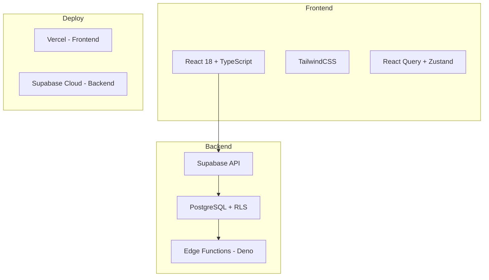
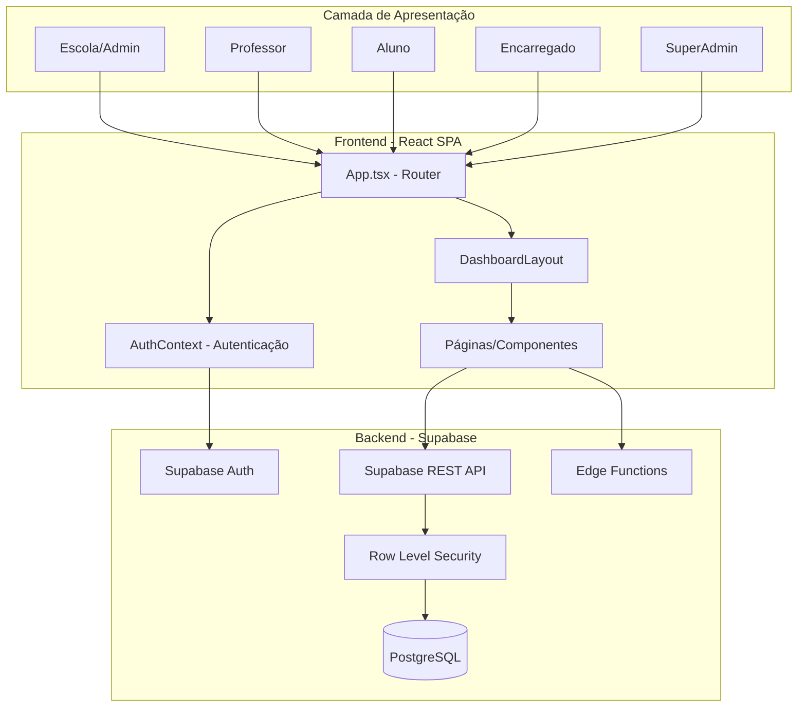
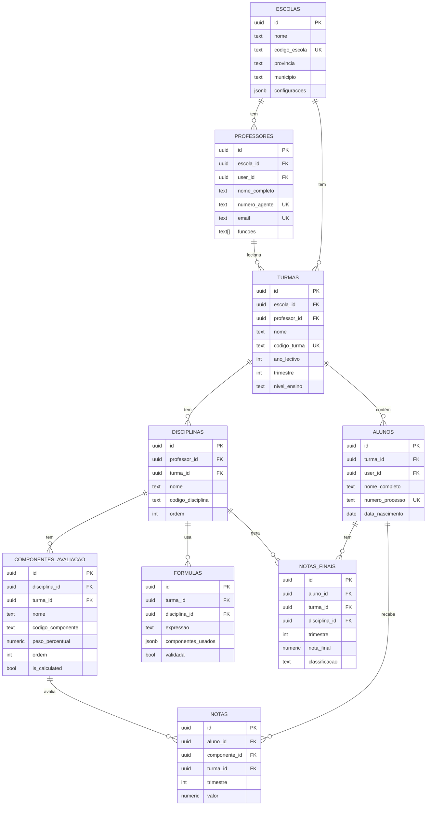
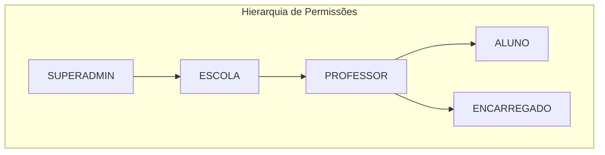
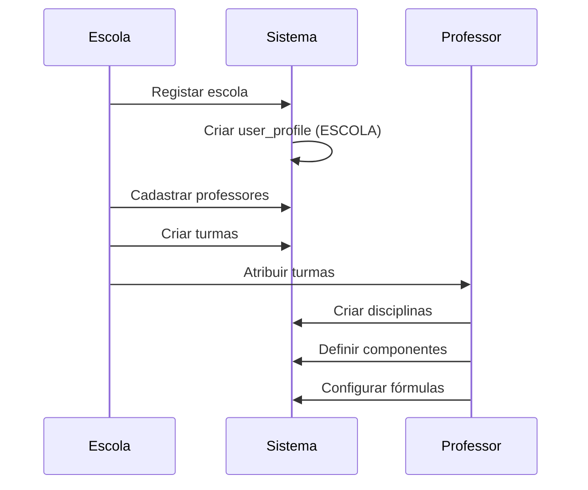
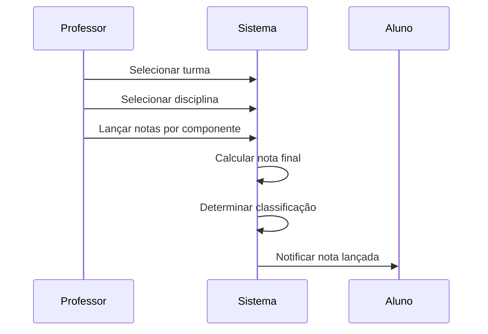
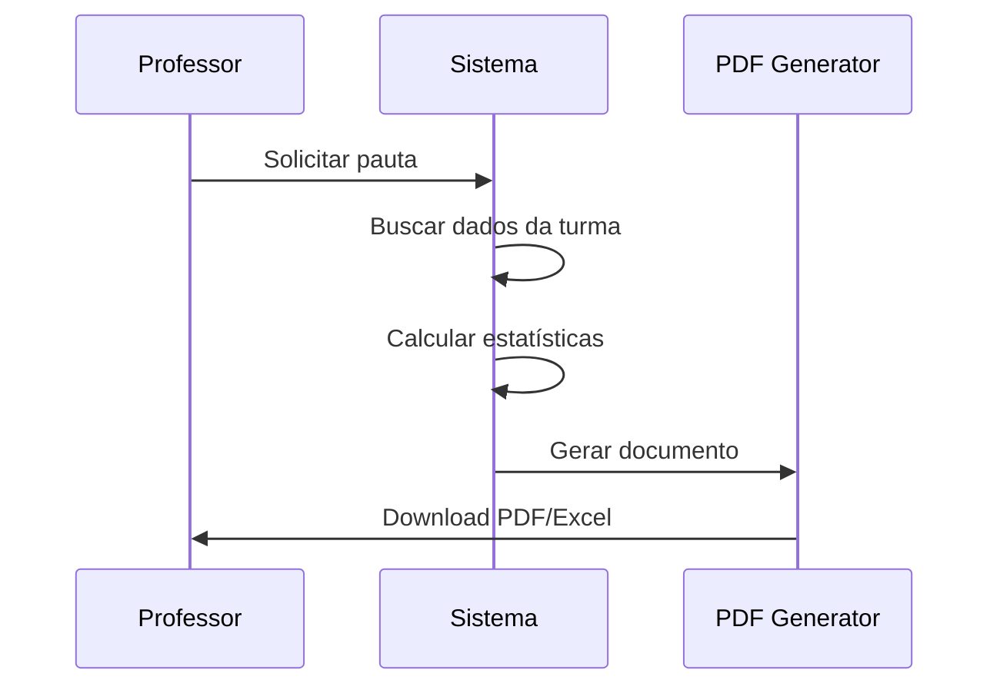
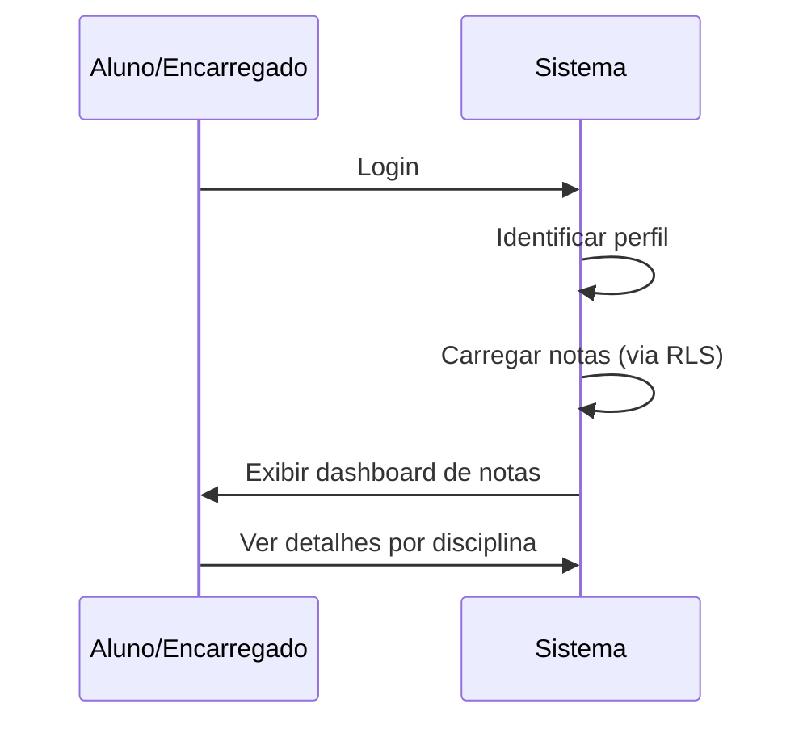

# 📚 EduGest Angola - Documentação Completa do Sistema

## Índice

1. [Visão Geral](#visão-geral)
2. [Objetivos do Sistema](#objetivos-do-sistema)
3. [Funcionalidades Principais](#funcionalidades-principais)
4. [Arquitetura do Sistema](#arquitetura-do-sistema)
5. [Modelo de Dados](#modelo-de-dados)
6. [Lógica de Negócio](#lógica-de-negócio)
7. [Segurança e RLS](#segurança-e-rls)
8. [Componentes do Frontend](#componentes-do-frontend)
9. [Fluxos de Utilização](#fluxos-de-utilização)
10. [Configuração e Deploy](#configuração-e-deploy)

---

## Visão Geral

**EduGest Angola** é um Sistema Integrado de Gestão Educacional desenvolvido especificamente para professores angolanos. O sistema oferece gestão completa de notas, turmas, avaliações e relatórios com cálculo automático baseado em fórmulas personalizáveis, seguindo o sistema educacional angolano de trimestres e a escala de classificação oficial (0-20 valores).

### Stack Tecnológico



| Camada | Tecnologia |
|--------|------------|
| **Frontend** | React 18, TypeScript, Tailwind CSS |
| **Estado** | React Query + Zustand |
| **Backend** | Supabase Edge Functions (Deno) |
| **Base de Dados** | PostgreSQL (Supabase) |
| **Autenticação** | Supabase Auth com JWT |
| **Deploy** | Vercel (Frontend) + Supabase (Backend) |

---

## Objetivos do Sistema

### Objetivos Primários

1. **Simplificar a Gestão de Notas**: Automatizar o lançamento e cálculo de notas finais para professores
2. **Padronização**: Garantir conformidade com o sistema educacional angolano (trimestres, escala 0-20)
3. **Transparência**: Permitir que alunos e encarregados acompanhem o desempenho académico
4. **Relatórios Automáticos**: Gerar pautas e relatórios em PDF/Excel automaticamente
5. **Multi-Escola**: Suportar múltiplas escolas com isolamento completo de dados

### Objetivos Secundários

- **Auditoria Completa**: Rastrear todas as alterações no sistema
- **Notificações Automáticas**: Alertar sobre notas lançadas e resultados
- **Fórmulas Personalizáveis**: Permitir configuração flexível de critérios de avaliação
- **Segurança**: Proteger dados sensíveis com Row Level Security (RLS)

---

## Funcionalidades Principais

### 🏫 Gestão de Escolas
- Cadastro de escolas com código único
- Configurações personalizadas por escola
- Bloqueio/desbloqueio de escolas (SuperAdmin)
- Estatísticas por província e município

### 👨‍🏫 Gestão de Professores
- Cadastro com número de agente único
- Atribuição a escolas e turmas
- Definição de funções (professor, coordenador, diretor)
- Dashboard personalizado

### 📚 Gestão de Turmas
- Criação de turmas por ano lectivo e trimestre
- Definição de nível de ensino (Primário/Secundário)
- Atribuição de capacidade máxima e turno
- Código de turma único

### 👨‍🎓 Gestão de Alunos
- Cadastro completo com dados pessoais e acadêmicos
- Número de processo único
- Vinculação a encarregados de educação
- Portal de consulta de notas

### 📖 Gestão de Disciplinas
- Criação de disciplinas por turma
- Definição de carga horária
- Ordenação personalizada para relatórios
- Obrigatoriedade configurável

### 📊 Componentes de Avaliação
- Criação de componentes (MAC, PP, PT, etc.)
- Definição de pesos percentuais
- Escalas de avaliação configuráveis
- Componentes calculados automaticamente

### 🧮 Sistema de Fórmulas
- Fórmulas personalizáveis por disciplina
- Validação automática de expressões
- Suporte a operadores (+, -, *, /)
- Funções: min, max, round, if

### 📝 Lançamento de Notas
- Interface intuitiva para lançamento
- Importação via CSV/Excel
- Cálculo automático de notas finais
- Validação de escalas

### 📄 Geração de Relatórios
- Mini-Pautas por disciplina
- Pautas Gerais por turma
- Termos de Frequência
- Exportação em PDF e Excel
- Configuração de cabeçalhos e cores

### 🔔 Sistema de Notificações
- Alertas automáticos de notas
- Notificações para alunos e encarregados
- Marcação de leitura

---

## Arquitetura do Sistema

### Diagrama de Arquitetura Geral



### Estrutura de Diretórios

```
dark-hubble/
├── src/
│   ├── App.tsx                 # Componente raiz e roteamento
│   ├── main.tsx               # Ponto de entrada
│   ├── index.css              # Estilos globais
│   ├── components/            # Componentes React (47 arquivos)
│   │   ├── Dashboard.tsx      # Dashboard principal
│   │   ├── ClassesPage.tsx    # Gestão de turmas
│   │   ├── StudentsPage.tsx   # Gestão de alunos
│   │   ├── GradesPage.tsx     # Lançamento de notas
│   │   ├── ReportsPage.tsx    # Relatórios e pautas
│   │   ├── LoginScreen.tsx    # Autenticação
│   │   └── ...
│   ├── contexts/
│   │   └── AuthContext.tsx    # Contexto de autenticação
│   ├── hooks/                 # Custom hooks
│   ├── lib/
│   │   └── supabaseClient.ts  # Cliente Supabase
│   ├── types/
│   │   └── index.ts           # Definições TypeScript
│   └── utils/                 # Utilitários (18 arquivos)
│       ├── gradeCalculations.ts    # Cálculos de notas
│       ├── formulaParser.ts        # Parser de fórmulas
│       ├── pdfGenerator.ts         # Geração de PDFs
│       ├── excelGenerator.ts       # Geração de Excel
│       ├── permissions.ts          # Controle de permissões
│       └── ...
├── supabase/
│   ├── schema.sql             # Schema principal
│   ├── migrations/            # 34 arquivos de migração
│   └── functions/             # Edge Functions
│       ├── calculate-final-grade/
│       ├── generate-report/
│       ├── import-csv/
│       └── send-notification/
└── docs/                      # Documentação
```

---

## Modelo de Dados

### Diagrama Entidade-Relacionamento



### Tabelas Principais

| Tabela | Descrição | Campos Chave |
|--------|-----------|--------------|
| `escolas` | Escolas cadastradas | id, nome, codigo_escola, provincia |
| `professores` | Professores do sistema | id, escola_id, user_id, numero_agente |
| `turmas` | Turmas/Classes | id, escola_id, ano_lectivo, trimestre |
| `alunos` | Alunos matriculados | id, turma_id, numero_processo |
| `disciplinas` | Disciplinas por turma | id, turma_id, professor_id |
| `componentes_avaliacao` | Componentes (MAC, PP, etc.) | id, disciplina_id, peso_percentual |
| `formulas` | Fórmulas de cálculo | id, disciplina_id, expressao |
| `notas` | Notas individuais | id, aluno_id, componente_id, valor |
| `notas_finais` | Notas finais calculadas | id, aluno_id, nota_final, classificacao |
| `user_profiles` | Perfis de utilizador | id, user_id, tipo_perfil |
| `auditoria` | Log de auditoria | id, tabela, operacao, dados |
| `notificacoes` | Notificações do sistema | id, destinatario_id, titulo |

---

## Lógica de Negócio

### Sistema de Classificação Angolano

O sistema utiliza a escala oficial de classificação do sistema educativo angolano:

| Intervalo | Classificação |
|-----------|---------------|
| 17 - 20 | **Excelente** |
| 14 - 16 | **Bom** |
| 10 - 13 | **Suficiente** |
| 0 - 9 | **Insuficiente** |

> [!IMPORTANT]
> A nota mínima para aprovação é **10 valores**.

### Cálculo de Notas Finais

O cálculo de notas finais segue a fórmula configurada por disciplina. O sistema suporta:

#### Componentes Padrão

```
MAC    = Média de Aproveitamento Contínuo
PP     = Prova Parcelar
PT     = Prova Trimestral
NPT    = Nota por Tentativa
NPG    = Nota de Pauta Geral
```

#### Exemplo de Fórmula

```
Nota Final = (MAC * 0.30) + (PP * 0.30) + (PT * 0.40)
```

#### Algoritmo de Cálculo

```typescript
function calculateNotaFinal(notas, componentes): NotaFinalCalculada {
    // 1. Mapear notas por componente
    const notasMap = new Map(notas.map(n => [n.componente_id, n.valor]))
    
    // 2. Calcular contribuição de cada componente
    let somaContribuicoes = 0
    let somaPesos = 0
    
    componentes.forEach(comp => {
        const valor = notasMap.get(comp.id)
        if (valor !== undefined) {
            const peso = comp.peso_percentual / 100
            const contribuicao = valor * peso
            somaContribuicoes += contribuicao
            somaPesos += comp.peso_percentual
        }
    })
    
    // 3. Calcular nota final (normalizada)
    const nota_final = somaPesos > 0 
        ? (somaContribuicoes / somaPesos) * 100 
        : 0
    
    // 4. Determinar classificação
    const classificacao = getClassificacao(nota_final)
    const aprovado = nota_final >= 10
    
    return { nota_final, classificacao, aprovado, detalhes }
}
```

### Parser de Fórmulas Personalizadas

O sistema inclui um parser seguro para fórmulas matemáticas:

```typescript
// Funções suportadas
min(a, b)      // Valor mínimo
max(a, b)      // Valor máximo
round(x)       // Arredondamento
if(cond, t, f) // Condicional

// Operadores
+ - * /        // Aritméticos

// Exemplo de uso
expressao = "(MAC * 0.30) + (PP * 0.30) + (PT * 0.40)"
```

### Estatísticas de Turma

```typescript
interface TurmaStatistics {
    total_alunos: number      // Total de alunos
    aprovados: number         // Alunos aprovados (>= 10)
    reprovados: number        // Alunos reprovados (< 10)
    taxa_aprovacao: number    // Percentual de aprovação
    media_turma: number       // Média da turma
    nota_minima: number       // Menor nota
    nota_maxima: number       // Maior nota
    distribuicao: {           // Distribuição por classificação
        'Excelente': number
        'Bom': number
        'Suficiente': number
        'Insuficiente': number
    }
}
```

---

## Segurança e RLS

### Níveis de Acesso (Roles)



| Role | Descrição | Permissões |
|------|-----------|------------|
| `SUPERADMIN` | Administrador global | Acesso total, gestão de escolas |
| `ESCOLA` | Administrador de escola | Gestão de professores, turmas, alunos |
| `PROFESSOR` | Docente | Gestão das suas turmas e notas |
| `ALUNO` | Estudante | Visualização das suas notas |
| `ENCARREGADO` | Responsável | Visualização das notas dos educandos |

### Row Level Security (RLS)

O sistema implementa RLS em todas as tabelas principais para garantir isolamento de dados:

#### Exemplo: Política para Turmas

```sql
-- Professores podem ver apenas suas próprias turmas
CREATE POLICY "Professors can view own classes"
    ON turmas FOR SELECT
    USING (professor_id IN (
        SELECT id FROM professores 
        WHERE user_id = auth.uid()
    ));

-- Professores podem criar turmas vinculadas a si
CREATE POLICY "Professors can create classes"
    ON turmas FOR INSERT
    WITH CHECK (professor_id IN (
        SELECT id FROM professores 
        WHERE user_id = auth.uid()
    ));
```

#### Exemplo: Política para Notas

```sql
-- Professores podem ver notas das suas turmas
CREATE POLICY "Professors can view grades"
    ON notas FOR SELECT
    USING (turma_id IN (
        SELECT id FROM turmas 
        WHERE professor_id IN (
            SELECT id FROM professores 
            WHERE user_id = auth.uid()
        )
    ));

-- Alunos podem ver suas próprias notas
CREATE POLICY "Students can view own grades"
    ON notas FOR SELECT
    USING (aluno_id IN (
        SELECT id FROM alunos 
        WHERE user_id = auth.uid()
    ));
```

### Triggers de Auditoria

Todas as operações em tabelas críticas são registradas automaticamente:

```sql
CREATE TRIGGER audit_notas 
    AFTER INSERT OR UPDATE OR DELETE ON notas
    FOR EACH ROW EXECUTE FUNCTION audit_trigger_function();
```

Campos registrados:
- `user_id`: Utilizador que fez a operação
- `tabela`: Tabela afetada
- `operacao`: INSERT, UPDATE ou DELETE
- `dados_antigos`: Estado anterior (JSON)
- `dados_novos`: Novo estado (JSON)
- `ip_address`: Endereço IP
- `created_at`: Timestamp

---

## Componentes do Frontend

### Componentes Principais

| Componente | Arquivo | Descrição |
|------------|---------|-----------|
| **App** | `App.tsx` | Router principal e gestão de rotas |
| **AuthProvider** | `AuthContext.tsx` | Contexto de autenticação e perfis |
| **DashboardLayout** | `DashboardLayout.tsx` | Layout principal com sidebar |
| **Dashboard** | `Dashboard.tsx` | Painel inicial com estatísticas |
| **LoginScreen** | `LoginScreen.tsx` | Tela de login |

### Páginas de Gestão

| Componente | Descrição |
|------------|-----------|
| `ClassesPage.tsx` | Listagem e gestão de turmas |
| `ClassDetailsPage.tsx` | Detalhes de uma turma específica |
| `StudentsPage.tsx` | Gestão de alunos |
| `TeachersPage.tsx` | Gestão de professores |
| `DisciplinesManagement.tsx` | Gestão de disciplinas |

### Páginas de Avaliação

| Componente | Descrição |
|------------|-----------|
| `GradesPage.tsx` | Lançamento de notas |
| `GradeEntry.tsx` | Interface de entrada de notas |
| `GradeImportModal.tsx` | Importação de notas (CSV/Excel) |
| `FormulaBuilder.tsx` | Construtor de fórmulas |

### Páginas de Relatórios

| Componente | Descrição |
|------------|-----------|
| `ReportsPage.tsx` | Central de relatórios (154KB) |
| `MiniPauta.tsx` | Mini-pauta por disciplina |
| `PautaGeralPage.tsx` | Pauta geral da turma |
| `TermoFrequenciaPreview.tsx` | Termo de frequência |

### Páginas por Role

| Role | Componente | Descrição |
|------|------------|-----------|
| SUPERADMIN | `SuperAdminDashboard.tsx` | Dashboard administrativo |
| SUPERADMIN | `EscolaManagement.tsx` | Gestão global de escolas |
| SUPERADMIN | `SuperAdminAuditLog.tsx` | Log de auditoria global |
| PROFESSOR | `ProfessorDashboard.tsx` | Dashboard do professor |
| ALUNO | `AlunoNotasPage.tsx` | Visualização de notas |
| ENCARREGADO | `EncarregadoNotasPage.tsx` | Notas dos educandos |

### Utilitários

| Arquivo | Função Principal |
|---------|------------------|
| `gradeCalculations.ts` | Cálculo de notas finais |
| `formulaParser.ts` | Parser de fórmulas matemáticas |
| `pdfGenerator.ts` | Geração de PDFs (~90KB) |
| `excelGenerator.ts` | Geração de planilhas Excel |
| `permissions.ts` | Verificação de permissões |
| `gradeUtils.ts` | Utilitários de notas |
| `notificationUtils.tsx` | Sistema de notificações |
| `studentClassification.ts` | Classificação de alunos |

---

## Fluxos de Utilização

### Fluxo 1: Registo e Configuração Inicial



### Fluxo 2: Lançamento de Notas



### Fluxo 3: Geração de Relatórios



### Fluxo 4: Consulta de Notas (Aluno/Encarregado)



---

## Configuração e Deploy

### Variáveis de Ambiente

```bash
# .env.local
VITE_SUPABASE_URL=https://your-project.supabase.co
VITE_SUPABASE_ANON_KEY=your-anon-key
```

### Instalação Local

```bash
# Clonar repositório
git clone <repository-url>
cd dark-hubble

# Instalar dependências
npm install

# Executar em desenvolvimento
npm run dev
```

### Configuração do Supabase

```bash
# Instalar CLI
npm install -g supabase

# Login
supabase login

# Vincular ao projeto
supabase link --project-ref <project-ref>

# Aplicar schema
supabase db push
```

### Deploy em Produção

#### Frontend (Vercel)

```bash
# Via CLI
vercel --prod

# Ou conectar repositório Git no dashboard Vercel
```

#### Backend (Supabase)

```bash
# Deploy Edge Functions
supabase functions deploy calculate-final-grade
supabase functions deploy generate-report
supabase functions deploy import-csv
supabase functions deploy send-notification
```

### Comandos Disponíveis

| Comando | Descrição |
|---------|-----------|
| `npm run dev` | Servidor de desenvolvimento |
| `npm run build` | Build de produção |
| `npm run preview` | Preview do build |
| `npm run lint` | Verificação de código |
| `npm run test` | Executar testes |
| `npm run type-check` | Verificação de tipos |

---

## Apêndices

### A. Estrutura de Tipos TypeScript

Os principais tipos estão definidos em `src/types/index.ts`:

- **Entidades**: `Escola`, `Professor`, `Turma`, `Aluno`, `Disciplina`, `Nota`, etc.
- **Perfis**: `UserProfile`, `EscolaProfile`, `ProfessorProfile`, `AlunoProfile`
- **Cálculos**: `NotaFinalCalculada`, `CalculoDetalhado`, `TurmaStatistics`
- **API**: `CreateTurmaRequest`, `SubmitGradeRequest`, etc.

### B. Edge Functions

| Função | Descrição |
|--------|-----------|
| `calculate-final-grade` | Calcula nota final de um aluno |
| `generate-report` | Gera relatórios em PDF |
| `import-csv` | Importa notas de arquivo CSV |
| `send-notification` | Envia notificações |

### C. Views de Relatórios

```sql
-- Mini-Pauta View
vw_mini_pauta

-- Estatísticas de Turma View
vw_estatisticas_turma

-- Desempenho do Aluno View
vw_desempenho_aluno
```

---

## Suporte

- **Email**: support@edugest.ao
- **WhatsApp**: +244 XXX XXX XXX
- **Documentação Online**: https://docs.edugest.ao

---

> Copyright © 2025 EduGest Angola. Todos os direitos reservados.
> Desenvolvido para professores angolanos, com o objetivo de simplificar a gestão de notas e melhorar a educação em Angola.
